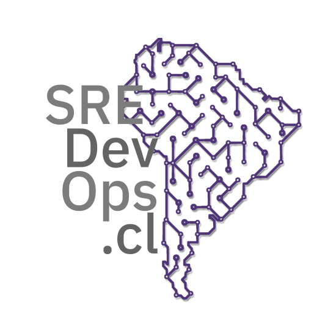

# sredevops.cl

Iniciativa que busca promover la cultura SRE/DevOps (como sus otras variantes DevSecOps, MLOps, etc), con enfoque en Chile y América Latina, a través de facilitar comunidades y contextos de apoyo, orientación y aprendizaje. Toda iniciativa es bienvenida, ésto es sólo el kickoff.

## Links:

-   Github: [https://github.com/sredevopscl](https://github.com/sredevopscl) 
-   Web (Just a landing): [https://sredevops.cl](https://sredevops.cl) 
-   email: info@sredevops.cl 
-   Mantainer:
    Nicolás Georger [https://github.com/ngeorger](https://github.com/ngeorger)
